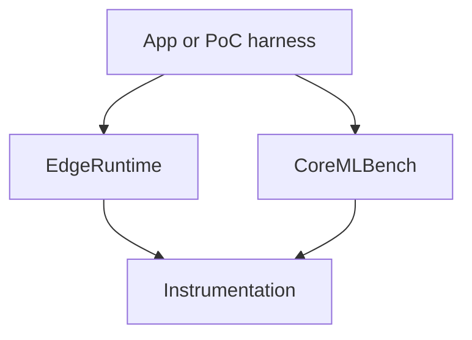

# Architecture

## Layers

- **Instrumentation** measures and records. It never decides anything.
- **EdgeRuntime** decides: how much context to allocate, whether to pause, whether to wait. Its
  policies are value types with pure `plan`/`afterRun` functions, so a PoC can swap in different
  numbers and compare them against the shipped defaults.
- **CoreMLBench** is a harness built on Instrumentation.

Planned: a llama.cpp engine wrapper that takes an `LLMContextPlan`, the document retrieval
pipeline from Xylo, document ingestion, and model download and verification.

## Device tiers

`DeviceTier` groups iPhones by `ProcessInfo.physicalMemory`: under 7.5 GB is *low* (6 GB
phones), under 11.5 GB is *mid* (8 GB), otherwise *high* (12 GB and up). iOS reports less than
the marketed size, so the thresholds sit below it.

The tier is a proxy. What limits a model at run time is headroom (`os_proc_available_memory()`)
and thermal state, and both policies below take those as inputs too.

## LLM context policy

`LLMContextPolicy` returns llama.cpp settings for one run. Defaults are what the Unawain app
ships (commit b0124e6) for summarizing documents with Gemma E2B/E4B Q4_K_M, and the engine
settings from Xylo (commit 9e103e8):

| Thermal | Tier | Context | GPU layers | Generation budget |
|---|---|---|---|---|
| serious/critical | high | 4,096 | 48 | as requested |
| serious/critical | mid | 2,048 | 48 | at most 352 |
| serious/critical | low | 2,048 | 48 | at most 350 |
| nominal/fair | high, 3 GB+ available | 4,096 | 99 (all) | 512 |
| nominal/fair | high with less headroom, or mid | 2,500 | 48 | as requested |
| nominal/fair | low | 2,048 | 48 | at most 350 |

Everywhere: 2 threads, `n_batch = min(2048, context)`, `n_ubatch` 256 on mid and high and 128 on
low, flash attention off. If context creation fails, retry at half the context with
`n_batch` 512. Don't load below 2.5 GB headroom; stop generating below 400 MB.

On 6 GB phones the context stays at 2,048 in every thermal state. The KV cache is a large part
of what grows with context, which is what [PoC 001](../../poc/001-kv-cache-quantization) tests.

## Cooldowns

`CooldownPolicy` spaces out repeated runs (Xylo, commit 9e103e8):

| Tier | Runs before a long pause | Base pause | Long pause | Base pause starts at |
|---|---|---|---|---|
| low | 5 | 10 s | 15 s | serious |
| mid | 3 | 20 s | 35 s | fair |
| high | 4 | 10 s | 25 s | fair |

Pauses scale with thermal state: nominal x0, fair x1, serious x1.5, critical x2. High-tier
devices skip pauses of 5 s or less.

Because nominal scales to zero, the long pause also comes out as zero on a cool device: the
counter resets and the next run starts right away. That is what the app does today, and a test
pins it. Whether a cool phone should still pause after several back-to-back runs is an open
question; a device run measuring thermal state across repeated runs would answer it.

## Waiting for resources

`ResourceWait.until` polls headroom and thermal state until both meet a target or a timeout
passes, and asks the allocator to return free pages on each poll. Presets from Unawain: after an
LLM unload, 800 MB for up to 3 s; between generation and translation, `fair` or cooler plus
600 MB, for 5 s on low-tier phones and 3 s on others.
